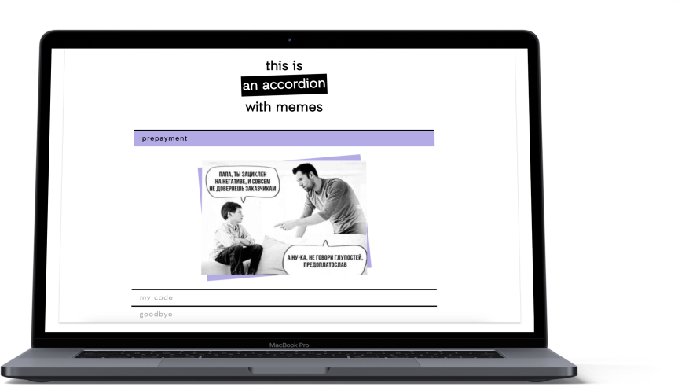

# cssBayan
It's a meme accordion with just HTML and CSS: [**→ project link**](https://kotangenss.github.io/cssBayan/cssBayan/index.html)

link to task: [**→ link**](https://github.com/DrDiman/CSS-Bayan-task)
